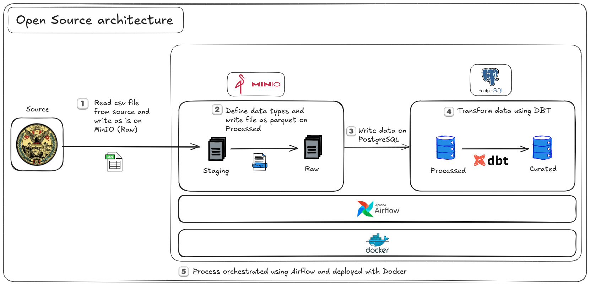

## 1. Overview

This project addresses a data engineering challenge to ingest, process, and model fire incident data for the city of San Francisco. The primary goal is to make this data available in a data warehouse, allowing for efficient dynamic querying and analysis by a business intelligence team. The solution involves creating an ETL (Extract, Transform, Load) pipeline orchestrated by Apache Airflow.

The pipeline performs the following key functions:
*   Extracts daily fire incident data from an external source (`data.sfgov.org`).
*   Stores the raw data in an object storage solution.
*   Transforms the raw data: applies a defined schema, standardizes column names, performs data type conversions, and handles basic deduplication.
*   Stores the processed data in Parquet format in object storage.
*   Loads the processed Parquet data into a PostgreSQL data warehouse, ensuring the warehouse reflects the exact current state of the source data.

## 1.1. Key Features (Reflecting SQL Logic)

- **Data Ingestion**: Fetches daily fire incident data from `data.sfgov.org`.
- **Staged Data Processing**:
    - **Schema Definition**: Creates tables in PostgreSQL for `processed_fire_incidents` (initial load from Parquet) and `curated_fire_incidents` (final, analysis-ready data).
    - **SQL-based Deduplication**: Removes duplicate records based on `incident_number` during the transformation from `processed_fire_incidents` to `curated_fire_incidents`.
    - **Data Cleaning & Transformation (SQL)**:
        - Handles missing or invalid geospatial `point` data by defaulting to `ST_Point(0, 0)` and converts it to the `GEOMETRY` type (SRID 4326) in the `curated_fire_incidents` table.
        - Columns with a high percentage of null values (identified as over 99.9% in `sql_queries.py`) are excluded from the `curated_fire_incidents` table. These include:
            - `number_of_floors_with_minimum_damage`
            - `number_of_floors_with_significant_damage`
            - `number_of_floors_with_heavy_damage`
            - `number_of_floors_with_extreme_damage`
            - `automatic_extinguishing_system_type`
            - `automatic_extinguishing_system_performance`
            - `automatic_extinguishing_system_failure_reason`
            - `number_of_sprinkler_heads_operating`
- **Data Storage & Analysis**: Utilizes PostgreSQL with the PostGIS extension for advanced geospatial capabilities in the `curated_fire_incidents` table.
- **Performance Optimization**: Creates indexes on key analytical columns (`battalion`, `neighborhood_district`, `supervisor_district`, `incident_date`) in the `curated_fire_incidents` table to enhance query performance.
- **Orchestration**: Leverages Apache Airflow to manage, schedule, and monitor the data pipeline workflows.
- **Centralized SQL Logic**: All DDL and DML for PostgreSQL are managed in `dags/sql_queries.py`.

## 2. Architecture

### 2.1. Local Development & Challenge Submission (Current)

For this challenge, an open-source stack was chosen to facilitate local development, reproducibility, and to avoid cloud-related costs. The architecture is containerized using Docker and Docker Compose.

*   **Orchestration:** Apache Airflow (v3.0) is used to define, schedule, and monitor the data pipelines (DAGs).
*   **Object Storage:** MinIO is used as an S3-compatible object storage service. It hosts:
    *   `raw/` data: The initially downloaded CSV files.
    *   `processed/` data: Parquet files after transformation.
*   **Data Warehouse:** PostgreSQL (with PostGIS extension) serves as the data warehouse to store the final `fire_incidents` table.
    *   *Note: The final analysis-ready table is `curated_fire_incidents`. `processed_fire_incidents` serves as an intermediate table.*
*   **ETL Scripting:** Python is the primary language for ETL logic, utilizing libraries such as:
    *   `requests` for data extraction.
    *   `pandas` for data manipulation and transformation.
    *   `pyarrow` for working with Parquet files.
    *   `psycopg2` and `SQLAlchemy` for PostgreSQL interaction.
*   **Containerization:** Docker and Docker Compose manage the services, ensuring a consistent environment.



### 2.2. Proposed AWS Cloud Architecture (Scalable Alternative)

For a production environment requiring scalability, reliability, and integration with a broader cloud ecosystem, the following AWS architecture is proposed:

*   **Data Ingestion:**
    *   An **AWS Lambda** function, triggered daily by an Amazon EventBridge (CloudWatch Events) rule, would execute the Python script to extract data from `sfgov.org`.
*   **Raw & Processed Data Storage:**
    *   **Amazon S3** would replace MinIO. Separate buckets or prefixes would be used for `raw/` (CSV) and `processed/` (Parquet) data.
*   **Data Processing/Transformation:**
    *   **AWS Glue ETL jobs** (running Python) would handle the transformation logic: reading raw CSVs from S3, applying schema, cleaning, standardizing, converting to Parquet, and writing back to S3.
    *   For very large datasets or highly complex transformations, **Amazon EMR** with Apache Spark could provide more control and performance.
*   **Data Warehouse:**
    *   **Amazon Redshift** would be the preferred OLAP data warehouse for its columnar storage, massively parallel processing (MPP) capabilities, and efficient analytical querying. Redshift Spectrum could be used to query data directly in S3 if needed.
    *   Alternatively, **Amazon RDS for PostgreSQL** (with PostGIS) could be used if existing PostGIS-specific functionalities are critical and cannot be easily replicated.
*   **Orchestration:**
    *   **AWS Managed Workflows for Apache Airflow (MWAA)** would provide a managed Airflow environment.
*   **Infrastructure as Code (IaC):**
    *   **AWS CloudFormation** or **HashiCorp Terraform** would be used to define, deploy, and manage all AWS resources, ensuring consistency and version control of the infrastructure.
*   **Monitoring & Logging:**
    *   **Amazon CloudWatch** for logs, metrics, and alarms for all AWS services and application components.
*   **Security:**
    *   **AWS IAM** (Identity and Access Management) for granular permissions.
    *   **S3 Bucket Policies** and **VPC (Virtual Private Cloud)** configurations for network isolation and data security.

## 3. Data Flow

The solution is implemented using two Airflow DAGs:

**DAG 1: `fire_incidents_etl_minio` (Extract & Load to Raw Storage)**
1.  `extract_parameters`: Fetches dynamic parameters (`cacheBust` token, current date) required for downloading the data from `data.sfgov.org`.
2.  `download_data`: Downloads the daily fire incidents CSV snapshot using the extracted parameters. The file is saved locally within the Airflow worker.
3.  `upload_to_minio`: Uploads the downloaded raw CSV file to the `fire-incidents` bucket in MinIO, under the `raw/` prefix.
4.  `cleanup`: Deletes the local CSV file from the Airflow worker after successful upload.

**DAG 2: `full_load_minio_postgres` (Transform & Load to Data Warehouse)**
1.  `find_latest_file`: Lists objects in the `raw/` prefix of the MinIO `fire-incidents` bucket and identifies the latest CSV file based on its filename (assuming a date-based naming convention).
2.  `convert_to_parquet`:
    *   Reads the latest raw CSV file from MinIO.
    *   Loads the schema definition from `/opt/airflow/dags/data_schema.json`.
    *   Standardizes column names (lowercase, replaces spaces/hyphens with underscores, corrects known typos).
    *   Applies data type conversions as specified in the schema (e.g., to Text, Number, Floating Timestamp).
    *   Performs basic deduplication based on `incident_number`.
    *   Writes the transformed DataFrame to a Parquet file in the `processed/` prefix of the MinIO `fire-incidents` bucket.
3.  `load_to_postgres`:
    *   Reads the processed Parquet file from MinIO.
    *   **Initial Load to Staging:**
        *   Connects to the PostgreSQL data warehouse.
        *   Ensures the PostGIS extension is enabled (`CREATE EXTENSION IF NOT EXISTS postgis;`).
        *   Drops and recreates the `processed_fire_incidents` table using the schema defined in `dags/sql_queries.py` (which should align with the Parquet file structure and `data_schema.json`).
        *   Loads the data from the Pandas DataFrame (read from Parquet) into the `processed_fire_incidents` table.
    *   **Transform and Load to Curated Table (SQL-based):**
        *   Drops and recreates the `curated_fire_incidents` table using the schema defined in `dags/sql_queries.py`. This table has a refined structure, including a `GEOMETRY` type for geospatial points.
        *   Populates `curated_fire_incidents` from `processed_fire_incidents` using a SQL query (defined as `query_dedup` in `sql_queries.py`). This query performs:
            *   Deduplication based on `incident_number`.
            *   Selection of relevant columns (excluding those with very high null percentages).
            *   Transformation of the `point` column (e.g., `varchar`) into a PostGIS `GEOMETRY` (SRID 4326), handling null or invalid points by defaulting to `ST_Point(0,0)`.
        *   Creates indexes on `battalion`, `neighborhood_district`, `supervisor_district`, and `incident_date` columns in `curated_fire_incidents` for query optimization, as defined in `sql_queries.py`.

## 3.1. Data Model (PostgreSQL)

The PostgreSQL data warehouse utilizes two main tables, defined in `dags/sql_queries.py`:

1.  **`processed_fire_incidents`**:
    *   **Purpose**: Acts as an intermediate staging table. Data from the processed Parquet files is loaded here directly.
    *   **Schema**: Reflects the schema of the Parquet files, likely containing all columns after initial Python-based transformations (standardization, type conversion from CSV).
    *   **Key Operations**: Table is dropped and recreated on each run. Data is bulk-loaded from Pandas DataFrame.

2.  **`curated_fire_incidents`**:
    *   **Purpose**: The final, analysis-ready table, optimized for querying.
    *   **Schema**: A refined schema derived from `processed_fire_incidents`.
        *   Excludes columns with excessively high null rates.
        *   Includes a `point` column of type `GEOMETRY` (SRID 4326) for geospatial analysis, converted from the source.
    *   **Key Operations**:
        *   Table is dropped and recreated on each run.
        *   Populated via a SQL `INSERT INTO ... SELECT ...` statement from `processed_fire_incidents`, which incorporates deduplication, column selection, and data type transformations (e.g., for the geometry point).
        *   Key analytical columns (`battalion`, `neighborhood_district`, `supervisor_district`, `incident_date`) are indexed.

## 4. Meeting Challenge Requirements

*   **Exact Copy in DWH:** The `load_to_postgres` task uses `if_exists='replace'` when writing to the PostgreSQL table. This ensures that each daily run completely overwrites the previous day's data, making the data warehouse an exact reflection of the current state of the data at the source (as per the latest daily snapshot).
    *   *Clarification:* The `processed_fire_incidents` table is replaced from Parquet. The `curated_fire_incidents` table is then rebuilt from `processed_fire_incidents`, ensuring it also reflects the latest state.
*   **Daily Updates:** Both DAGs are scheduled with `@daily`. It's assumed the source dataset is updated daily.
*   **Aggregation Dimensions:** The `curated_fire_incidents` table in PostgreSQL includes `incident_date` (timestamp), `neighborhood_district` (text), `supervisor_district` (text), and `battalion` (text). These columns are indexed for efficient querying and aggregation as per `sql_queries.py`.
*   **Report on Model Usage:** Sample SQL queries demonstrating how to use the model are provided in Section 8 of this README.
*   **Technology Choice:** Dockerized open-source tools (Airflow, MinIO, PostgreSQL, Python/Pandas) were chosen for local development to fulfill the challenge requirements without incurring cloud costs. A scalable AWS alternative is also described.
*   **Modularization (Suggestion 1a):**
    *   The pipeline is split into two Airflow DAGs, separating the initial extraction and raw storage from the transformation and DWH loading.
    *   Within DAGs, tasks are modular Python functions using the `@task` decorator.
    *   Helper scripts (`extract_fire_incidents_data.py`, `minio_utils.py`, `load_to_postgres.py`) encapsulate specific functionalities.
*   **Data Quality Checks (Suggestion 2a):**
    *   *Current:* Basic data type conversions and schema enforcement are applied in the `convert_to_parquet` task. Column name standardization and typo correction are also performed.
    *   *Planned/Future:* Implement dedicated Airflow tasks for more explicit data quality checks:
        *   Before loading to Parquet: Validate raw CSV (e.g., row count > 0, presence of critical columns).
        *   After Parquet conversion: Check Parquet schema against `data_schema.json`, check for unexpected nulls in key columns.
        *   After loading to PostgreSQL: Query PostgreSQL to verify row counts match Parquet, check distinct counts on dimensions like `battalion` or `neighborhood_district`.
*   **Environment Variables for Credentials/Configurations (Suggestion 3a):**
    *   *Current:* MinIO and PostgreSQL connection details are hardcoded in the Python scripts for simplicity within the Docker environment. Bucket and folder names are defined as constants in the `dag_full_load_minio_postgres.py` DAG file.
    *   *Recommendation/Best Practice:* For a more robust setup, these should be externalized using:
        *   **Airflow Connections:** For MinIO (S3 type) and PostgreSQL credentials. The Python scripts would then use Airflow Hooks (`S3Hook`, `PostgresHook`) to retrieve these connections.
        *   **Airflow Variables:** For configurations like bucket names (`FIRE_INCIDENTS_BUCKET`) and folder paths (`RAW_FOLDER`, `PROCESSED_FOLDER`).
*   **Enhanced Deduplication Logic (Suggestion 4a):**
    *   Python-level deduplication (`df.drop_duplicates()`) is applied before writing to Parquet.
    *   SQL-level deduplication is performed when populating `curated_fire_incidents` from `processed_fire_incidents`, typically using `ROW_NUMBER()` partitioned by `incident_number` and keeping the first occurrence (as defined in `query_dedup` in `sql_queries.py`).
    *   The `curated_fire_incidents` table could also have a `PRIMARY KEY` constraint on `incident_number` if desired, though the SQL deduplication step already ensures uniqueness from the source.
*   **Filter Data by Date (Suggestion 5a):**
    *   The `extract_fire_incidents_data.py` script is designed to download the latest available daily snapshot from the source. The `cacheBust` parameter helps in fetching the most recent version. This inherently processes only relevant (current) data for the daily update.
*   **Improve Conflict Handling (Suggestion 6a):**
    *   The current strategy for loading data into `processed_fire_incidents` is `df.to_sql(..., if_exists='replace')`. Subsequently, `curated_fire_incidents` is also dropped and recreated. This approach directly satisfies the requirement that "the copy of the dataset in the data warehouse should reflect exactly the current state of the data at the source" for a daily full refresh.
    *   For scenarios involving incremental updates or preserving history, strategies like `ON CONFLICT DO NOTHING` or `ON CONFLICT DO UPDATE` (upsert) would be implemented, potentially with a staging table.

## 4.1. Core SQL Logic

All PostgreSQL Data Definition Language (DDL) and Data Manipulation Language (DML) statements are centralized in the `dags/sql_queries.py` file. This includes:

- `CREATE EXTENSION IF NOT EXISTS postgis;`
- `DROP TABLE IF EXISTS ...` statements for `processed_fire_incidents` and `curated_fire_incidents`.
- `CREATE TABLE processed_fire_incidents (...)` statement, defining the schema for data loaded from Parquet.
- `CREATE TABLE curated_fire_incidents (...)` statement, defining the schema for the final, analysis-ready data, including the `GEOMETRY` column for geospatial points.
- The main transformation query (`query_dedup`): An `INSERT INTO curated_fire_incidents SELECT ... FROM processed_fire_incidents ...` statement that handles:
    - Deduplication based on `incident_number`.
    - Selection of specific columns for the curated table.
    - Conversion of `point` data to PostGIS `GEOMETRY` (SRID 4326), with default handling for null/invalid values.
- `CREATE INDEX ...` statements for `battalion`, `neighborhood_district`, `supervisor_district`, and `incident_date` on the `curated_fire_incidents` table to optimize query performance.

## 5. Assumptions

*   The source URL (`https://data.sfgov.org/api/views/wr8u-xric/rows.csv`) provides a complete and accurate daily snapshot of fire incidents.
*   The `cacheBust` parameter obtained from `https://data.sfgov.org/Public-Safety/Fire-Incidents/wr8u-xric/about_data` is sufficient to get the latest data.
*   `Incident Number` is a reliable unique identifier for each fire incident.
*   The schema defined in `data_schema.json` accurately represents the desired structure and data types for the data warehouse.
*   The Docker services (MinIO, PostgreSQL) are accessible within the Docker network using their service names (e.g., `http://minio:9000`, `postgres-data:5432`).

## 6. Thought Process & Design Choices

*   **Local Development Environment:** Docker and Docker Compose were chosen to create a self-contained, reproducible environment. This simplifies setup for the challenge reviewer and avoids cloud service costs. MinIO serves as an S3-compatible local alternative, and PostgreSQL acts as the data warehouse.
*   **Orchestration:** Apache Airflow is a standard tool for orchestrating complex data pipelines. Its features for scheduling, task dependency management, monitoring, and retries make it suitable for this ETL process.
*   **Data Storage Layers:**
    *   **Raw Layer (MinIO):** Storing the initially downloaded CSV "as-is" provides a source of truth and allows for reprocessing if needed without re-downloading.
    *   **Processed Layer (MinIO - Parquet):** Parquet is chosen for its columnar storage format, which is highly efficient for analytical queries and offers good compression. This layer holds cleaned and schema-conformed data.
*   **Schema Enforcement:** A JSON file (`data_schema.json`) defines the expected schema. The transformation task in `load_to_postgres.py` uses this to convert data types and identify discrepancies. Column names are standardized to lowercase with underscores for consistency. Known typos in source column names are also corrected during this process.
*   **Idempotency & Data Freshness:** The final load to PostgreSQL (both `processed_fire_incidents` and `curated_fire_incidents`) uses a drop-and-recreate strategy. This ensures that each run of the pipeline results in the tables containing only the data from the latest daily snapshot, fulfilling the requirement for an exact reflection of the source.
*   **Modularity:** The problem was broken down into two DAGs for logical separation of concerns (ingestion vs. processing/loading). Within DAGs, Python functions are used for individual tasks.

## 7. Setup and Usage Instructions

### Prerequisites
*   Docker
*   Docker Compose

### Steps
1.  **Clone the Repository:**
    ```bash
    git clone https://github.com/mariusss21/fire-incidents-sf.git
    ```

2.  **Environment Configuration (Optional):**
    If you are on Linux and encounter file permission issues with Docker volumes, you can set the `AIRFLOW_UID` in a `.env` file:
    
    echo "AIRFLOW_UID=$(id -u)" > .env
    ```

3.  **Build and Start Services:**
    From the directory, run:
    ```bash
    docker-compose up -d --build
    ```
    This will build the Airflow image (if a local Dockerfile is used, otherwise pulls from Docker Hub) and start all services (Airflow components, PostgreSQL, Redis, MinIO).

4.  **Access Services:**
    *   **Airflow UI:** `http://localhost:8080`
        *   Credentials: `airflow` / `airflow` (default from `docker-compose.yaml`)
    *   **MinIO Console:** `http://localhost:8082`
        *   Credentials: `minioadmin` / `minioadmin`
    *   **PostgreSQL (Data Warehouse):**
        *   Host: `localhost`
        *   Port: `5433`
        *   Database: `data_db`
        *   User: `data_user`
        *   Password: `data_password`
        (You can connect using `psql` or a GUI client like DBeaver/pgAdmin).

5.  **Airflow Configuration:**
    *   In the Airflow UI, navigate to "DAGs".
    *   Unpause the `fire_incidents_etl_minio` and `full_load_minio_postgres` DAGs.
    *   **Important for Correct Operation (if not using Airflow Connections yet):** Ensure the `endpoint_url` in `minio_utils.py` and DAG task calls is `http://minio:9000` for communication within the Docker network. The PostgreSQL connection in `load_to_postgres.py` should use `host="postgres-data"`.
    *   **(Recommended for Best Practice):** Configure Airflow Connections:
        *   Go to Admin -> Connections.
        *   Create `minio_default`: Conn Type `S3`, AWS Access Key ID `minioadmin`, AWS Secret Access Key `minioadmin`, Extra `{"endpoint_url": "http://minio:9000"}`.
        *   Create `postgres_dw`: Conn Type `Postgres`, Host `postgres-data`, Schema `data_db`, Login `data_user`, Password `data_password`, Port `5432`.
        *   (Code would then need to be updated to use these connections via `S3Hook` and `PostgresHook`).
    *   **(Recommended for Best Practice):** Configure Airflow Variables:
        *   Go to Admin -> Variables.
        *   Create `fire_incidents_bucket_name` with value `fire-incidents`.
        *   Create `fire_incidents_raw_folder` with value `raw`.
        *   Create `fire_incidents_processed_folder` with value `processed`.
        *   (Code would then need to be updated to use `Variable.get("variable_name")`).

6.  **Trigger DAGs:**
    *   You can manually trigger the `fire_incidents_etl_minio` DAG first. Once it completes successfully, trigger the `full_load_minio_postgres` DAG.
    *   The DAGs are also scheduled to run daily (`@daily`).

## 8. Sample Report Queries (SQL)

Once the `full_load_minio_postgres` DAG has successfully run, you can query the `curated_fire_incidents` table in the `data_db` PostgreSQL database.

**1. Number of incidents per battalion for the last full month:**
```sql
SELECT
    battalion,
    COUNT(incident_number) AS num_incidents
FROM curated_fire_incidents
WHERE incident_date >= date_trunc('month', current_date - interval '1 month')
  AND incident_date < date_trunc('month', current_date)
GROUP BY battalion
ORDER BY num_incidents DESC;
```

**2. Number of incidents per neighborhood district and year:**
```sql
SELECT
    EXTRACT(YEAR FROM incident_date) AS incident_year,
    neighborhood_district,
    COUNT(incident_number) AS num_incidents
FROM curated_fire_incidents
GROUP BY incident_year, neighborhood_district
ORDER BY incident_year DESC, num_incidents DESC;
```

**3. Top 5 primary situations leading to fire incidents:**
```sql
SELECT
    primary_situation,
    COUNT(incident_number) AS num_incidents
FROM curated_fire_incidents
GROUP BY primary_situation
ORDER BY num_incidents DESC
LIMIT 5;
```

## 9. Future Enhancements & Considerations

*   **Comprehensive Data Quality Framework:** Integrate a tool like Great Expectations or add more detailed SQL-based checks within Airflow for robust data validation at various stages.
*   **Enhanced Error Handling & Alerting:** Implement more sophisticated error handling and configure Airflow alerts (e.g., email, Slack) for pipeline failures.
*   **Incremental Loads:** If the source data volume grows significantly or if historical data needs to be preserved with updates, the pipeline could be adapted for incremental loads. This would involve changes to the load process (e.g., using staging tables and `ON CONFLICT UPDATE` or merge logic).
*   **Unit and Integration Testing:** Develop unit tests for Python helper functions and integration tests for the Airflow DAGs to ensure reliability and facilitate refactoring.
*   **dbt Integration:** As suggested in the challenge, `dbt` could be incorporated to manage SQL-based transformations, data modeling within the warehouse, and data testing, especially as the complexity of the DWH model grows.
*   **Advanced Data Modeling:** For a production-scale DWH, especially in Redshift, implement a proper dimensional model (e.g., star or snowflake schema) to optimize analytical query performance.
*   **CI/CD Pipeline:** Set up a Continuous Integration/Continuous Delivery pipeline (e.g., using GitHub Actions) for automated linting, testing, and deployment of DAGs and infrastructure changes.
*   **Parameterization:** Further parameterize DAGs (e.g., for date ranges if backfilling becomes a requirement).

```
